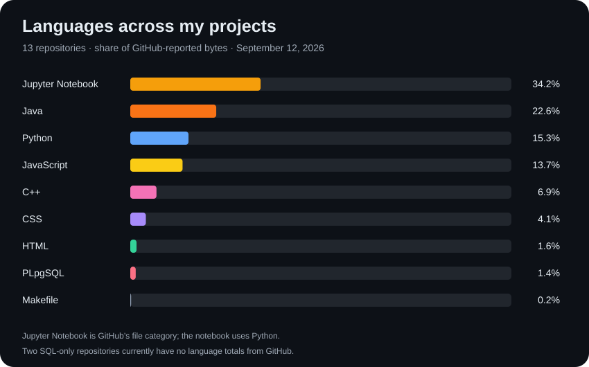

# Hi, I'm Richard 👋

I build projects in Python, Java, C++, JavaScript, and SQL, exploring machine learning, databases, pathfinding, and practical web applications.

## Language overview

Snapshot of GitHub-reported language bytes across all 13 public project repositories, excluding this profile repository. Notebook bytes are shown as **Jupyter Notebook** (the code uses Python). GitHub currently returns no language totals for Jam Ingredients Database and Student Grades Database, so their SQL is not represented in the percentages. This measures repository content, not proficiency. [View source totals](language-data.json).

## Featured project

**[Inbox Lens](https://github.com/RichardShiw04/inbox-lens)** — a local email spam classifier with word-level explanations, a browser interface, CSV training, and held-out evaluation. Built with Python's standard library and automated tests.

## Projects

Each project has its own repository with setup instructions and documented verification limits.

| Project | What it does |
| --- | --- |
| [Anime Vector Search](https://github.com/RichardShiw04/anime-vector-search) | A notebook comparing semantic retrieval with a simple lexical TF-IDF baseline over anime descriptions. Sentence Transformers generates MiniLM embeddings; Qdrant stores them in memory and returns similar descriptions. |
| [Card Matching Game](https://github.com/RichardShiw04/card-matching-game) | A C++ card-matching game against a computer, using custom Card and Deck classes. |
| [DNA Sequence Alignment](https://github.com/RichardShiw04/dna-sequence-alignment) | Needleman–Wunsch sequence alignment with three scoring schemes, traceback reconstruction, and DNA sample inputs. |
| [Hex Grid Pathfinding](https://github.com/RichardShiw04/hex-grid-pathfinding) | A* search across a weighted hexagonal map, with a hashed-heap frontier and animated path visualization. |
| [Jam Ingredients Database](https://github.com/RichardShiw04/jam-ingredients-database) | A PostgreSQL relational model for jams, ingredients, and prices. Two foreign keys link each jam to its ingredients, and a join produces a readable product report. |
| [Maze Pathfinder](https://github.com/RichardShiw04/maze-pathfinder) | Random maze generation, depth-first pathfinding, and parent-path visualization in Java. |
| [OrientDB Order Manager](https://github.com/RichardShiw04/orientdb-order-manager) | A Node.js store simulation with product seeding, random orders, customer invoices, price updates, and a recurring sales report. Orders retain item-price snapshots. |
| [PostgreSQL Query Tools](https://github.com/RichardShiw04/postgresql-query-tools) | Small Python utilities for connecting to PostgreSQL and printing query results. |
| [Stock Market Dashboard](https://github.com/RichardShiw04/stock-market-dashboard) | A React dashboard and FastAPI backend for stock quotes, charts, fundamentals, news, and user profiles. Finnhub provides market data; Supabase provides authentication and PostgreSQL-backed profile/watchlist storage. |
| [Student Grades Database](https://github.com/RichardShiw04/student-grades-database) | PostgreSQL tables and joins for students, courses, and final grades. |
| [Word Finder](https://github.com/RichardShiw04/word-finder) | A Java desktop word-search application backed by a trie, with prefix traversal exercises. |
| [Movie Genre Classification](https://github.com/RichardShiw04/Richard-Shiwmangal--Self-Project-code) | Movie-plot genre prediction with a Naive Bayes baseline and a DistilBERT model. |

## What I'm exploring

Text classification · vector search · relational and graph databases · dynamic programming · pathfinding · React and Python APIs

Project READMEs distinguish completed checks from work that still needs live-service or graphical verification.
